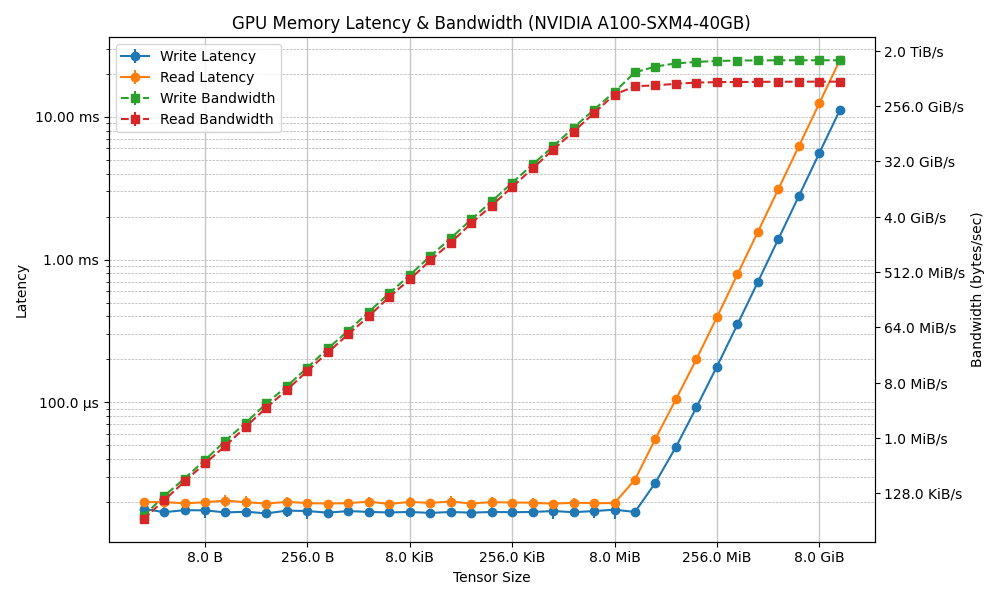

# GPU Memory and NCCL Benchmarking Suite

This project provides a comprehensive suite for benchmarking GPU memory operations and NCCL collective operations. The results are visualized in the form of plots for different GPU models and operations.

---

## Features

- **Memory Bandwidth Testing**: Measure and plot memory bandwidth of various GPU memory operations
- **Memory Latency Testing**: Measure and plot memory latency characteristics 
- **NCCL Bandwidth Testing**: Measure and plot NCCL collective operation bandwidth
- **Multi-GPU Support**: Test across multiple GPUs in a single node
- **SLURM Integration**: Run tests across multiple nodes in a SLURM cluster
- **Extensible Architecture**: Easily add new test functions and compare between them
- **Publication-Quality Plots**: Generate detailed plots for analysis and comparison

---

## Methodology

### Memory Benchmarks
- Timing is done using CUDA event timers to ensure accurate GPU-side measurements
- Measurements are performed for a range of tensor sizes (from a few bytes up to several GiB)
- Results are averaged over several runs with configurable warmup iterations
- Supported operations include:
  - `zero`: Fill tensor with zeros
  - `fill`: Fill tensor with a specific value
  - `copy`: Copy data from source tensor to destination tensor
  - `add`: Add two tensors
  - `mul`: Multiply two tensors element-wise

### NCCL Benchmarks
- Measures the performance of various NCCL collective operations
- Supports both single-node and multi-node (SLURM) execution
- Supported operations include:
  - `all_reduce`: All-reduce operation (sum)
  - `all_gather`: All-gather operation
  - `broadcast`: Broadcast operation
  - `reduce`: Reduce operation (sum)
  - `reduce_scatter`: Reduce-scatter operation (sum)
  - `all_to_all`: All-to-all operation

### Bandwidth Calculation
- For memory operations, bandwidth is calculated as: **Bandwidth (GB/s) = Tensor Size (GB) / Latency (s)**
- For NCCL operations, bandwidth accounts for the actual data transferred between ranks

---

## Example Results

Below are the plots generated for two NVIDIA GPUs present on Snellius:

### NVIDIA A100-SXM4-40GB


### NVIDIA H100-SXM5-94GB


---

## Installation

```bash
# Clone the repository
git clone https://github.com/yourusername/gpu-perf-check.git
cd gpu-perf-check

# Create a virtual environment (optional)
python -m venv venv
source venv/bin/activate

# Install dependencies
pip install -r requirements.txt
```

## Usage

### Command-Line Interface

The benchmarking suite provides a unified command-line interface:

```bash
# Memory bandwidth benchmark
python cli.py memory-bandwidth --gpu 0 --operations zero fill copy --runs 10

# Memory latency benchmark
python cli.py memory-latency --gpu 0 --operations zero fill copy --runs 10

# NCCL benchmark (single node)
python cli.py nccl --gpu 0 --operations all_reduce all_gather broadcast --runs 10

# NCCL benchmark (SLURM multi-node)
srun -N 2 --ntasks-per-node=4 --gpus-per-node=4 python cli.py nccl --slurm --operations all_reduce all_gather

# List available operations
python cli.py list-ops
```

### Python API

You can also use the benchmarking modules directly in your Python code:

```python
from benchmarks.memory.bandwidth import MemoryBandwidthTest
from benchmarks.nccl.bandwidth import NCCLBandwidthTest

# Memory bandwidth benchmark
benchmark = MemoryBandwidthTest(device_id=0, operations=['zero', 'fill', 'copy'])
result = benchmark.run()
benchmark.plot(result)

# NCCL bandwidth benchmark
benchmark = NCCLBandwidthTest(device_id=0, operations=['all_reduce', 'all_gather'])
result = benchmark.run()
benchmark.plot(result)
```

### Extending with Custom Operations

You can extend the suite with custom operations by adding them to the appropriate registry:

```python
from benchmarks.memory.operations import MEMORY_OPERATIONS
from benchmarks.base import TestFunctionRegistry

# Register a custom memory operation
MEMORY_OPERATIONS['custom_op'] = {
    'description': 'Custom memory operation',
    'parameters': {'param1': 'value1'}
}

# Use the custom operation
benchmark = MemoryBandwidthTest(operations=['custom_op'])
```

---

## License
MIT
