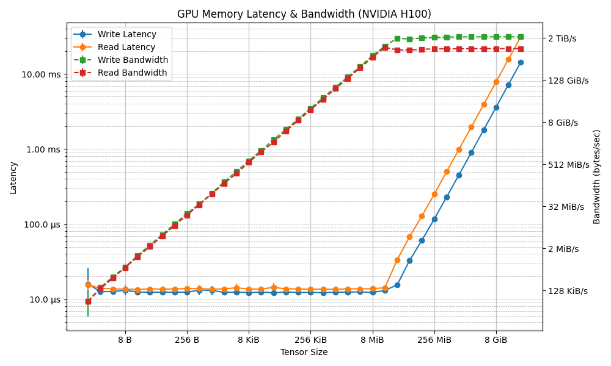

# GPU Memory Latency and Bandwidth Benchmark

This project provides scripts to benchmark GPU memory latency and bandwidth using PyTorch. The results are visualized in the form of plots for different GPU models.

---

## Methodology
- Timing is done using CUDA event timers to ensure accurate GPU-side measurements. The operation is repeated several times, and the mean and standard deviation are reported.
- Measurements are performed for a range of tensor sizes (from a few bytes up to several GiB).
- Results are averaged over several runs.


### Latency Measurement
- **Write Latency:**
  - Performance is checked with the `tensor.fill_` method.
  - For maximum bitflips, the byte-tensor is filled with `11111111` (255) after being initialized to `00000000` (0).
  
- **Read Latency:**
  - For minimum bitflips, the tensor is filled with `00000000` (0) after already being set to `00000000` (0).
  - The contents of the tensor are read by copying it to another tensor (`outp_tensor.copy_(inp_tensor)`), ensuring all elements are accessed.

### Bandwidth Calculation
- For each memory operation, bandwidth is calculated as:
  - **Bandwidth (GiB/s) = Tensor Size (GiB) / Latency (s)**
- Standard deviation is propagated from the latency measurements.

---

## Example Results

Below are the plots generated for two NVIDIA GPUs present on Snellius:

### NVIDIA A100-SXM4-40GB


### NVIDIA H100-SXM5-94GB


---

## Usage

Run the benchmark script (e.g., for latency and bandwidth):
```bash
python test-memory-latency-bandwidth.py
```

Results will be printed to the console and saved as a plot PNG file named after the detected GPU.

---

## License
MIT
